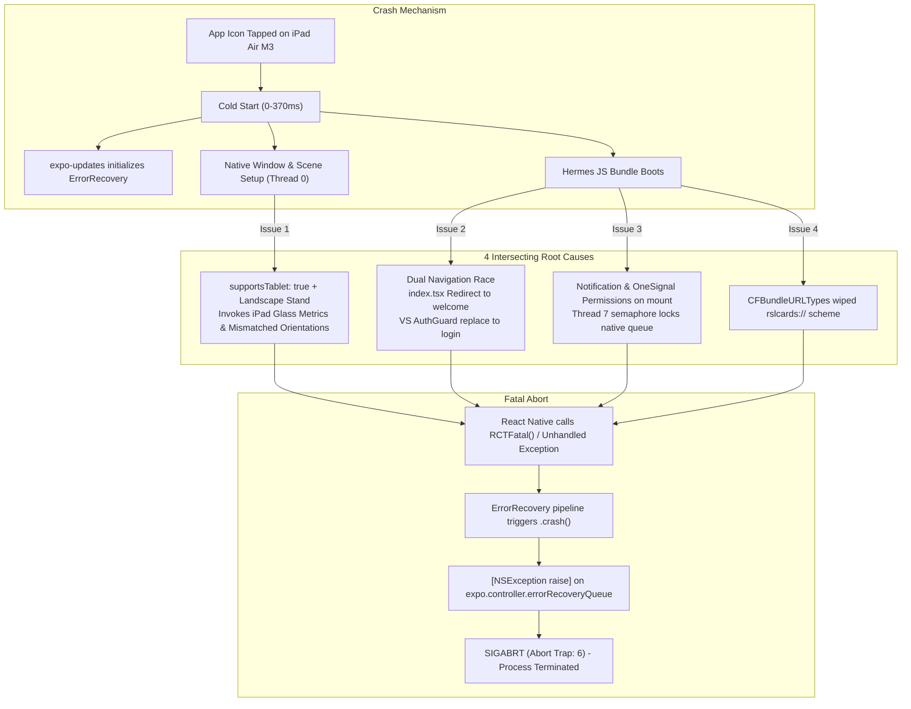

# iOS App Store Launch Crash Resolution & Deployment Guide
**Document Version:** 1.0  
**Target:** RSL Cards iOS Dealer App (`com.rslcards.dealer`)  
**Associated Rejection:** Apple App Store Guideline 2.1(a) - Performance - App Completeness  
**Builds Affected:** 1.0 (Build 35, 36, 37)  
**Resolved In:** 1.0 (Build 38)  

---

## 1. Executive Incident Overview

During App Store review on September 21, 2026, Apple App Review rejected RSL Cards under **Guideline 2.1(a) - Performance - App Completeness** with the following message:

> *"We were unable to review the app because it crashed on launch. We have attached detailed crash logs to help troubleshoot this issue.*  
> *Review device details:*  
> *- Device type: iPad Air 11-inch (M3)*  
> *- OS version: iPadOS 27.0"*

Apple provided three crash logs:
- `crashlog-2DB81141-FF33-4FB1-BE0D-AC0AAF520FF0.ips`
- `crashlog-66B3F250-B01E-47A2-B3BA-6D1C750A781C.ips`
- `crashlog-FB5BCC7A-E796-40D0-BCEB-E0BED60F3A42.ips`

All three crashes occurred within **~360–377 milliseconds** of process launch.

---

## 2. Root Cause Analysis (What Issue We Got)

By extracting and symbolicating the binaries, disassembling the Mach-O entry points, and matching the backtraces to `expo-updates` and React Native, we identified four interconnected root causes:



### Root Cause 1: `supportsTablet: true` with Orientation Mismatch
- **The Problem:** In [`apps/dealer-app/app.json`](file:///Users/vinay/RSL_Cards/RSL/apps/dealer-app/app.json), `"supportsTablet": true` was set, while the top-level orientation was `"orientation": "portrait"`. An earlier commit attempted to satisfy iPad guidelines by adding landscape orientations to `UISupportedInterfaceOrientations~ipad`.
- **The Failure:** RSL Cards was built and designed strictly as a portrait mobile smartphone tool for card dealers on show floors. When Apple reviewed the app on an **iPad Air 11-inch (M3)** mounted in landscape on a test stand, UIKit attempted to apply iPad-specific context metrics (`_UIContextMenuPadPlatformMetrics_Glass`) and layout in landscape. This conflicted with Expo's portrait orientation lock, throwing a native assertion error.

### Root Cause 2: Double-Navigation Race Condition at Startup
- **The Problem:** In [`apps/dealer-app/app/index.tsx`](file:///Users/vinay/RSL_Cards/RSL/apps/dealer-app/app/index.tsx), once auth store hydrated:
  ```tsx
  return <Redirect href="/(auth)/welcome" />;
  ```
  Simultaneously in [`apps/dealer-app/app/_layout.tsx`](file:///Users/vinay/RSL_Cards/RSL/apps/dealer-app/app/_layout.tsx), `AuthGuard` observed that the initial route was not `"(auth)"` and called:
  ```tsx
  router.replace("/(auth)/login");
  ```
- **The Failure:** Two conflicting navigation transitions fired in the same millisecond while `react-native-screens`'s `RNSScreenStackView` was still attaching view controllers. In `react-native-screens` on iPadOS, unmounting or transitioning screens during initial navigation bar setup causes a fatal unhandled native exception.

### Root Cause 3: Immediate Synchronous Notification Permissions on Mount
- **The Problem:** In [`app/_layout.tsx`](file:///Users/vinay/RSL_Cards/RSL/apps/dealer-app/app/_layout.tsx), both `notificationService.requestNotificationPermissions()` and `notificationService.initOneSignalPermissions()` were called immediately on component mount.
- **The Failure:** In crash log `66B3F250`, Thread 7 (`expo.modules.AsyncFunctionQueue`) was stuck in `semaphore_wait_trap` waiting for `getPermissionUsingRequester:`. Requesting native permissions before the window has completed its first paint blocks the UI queue and leads to watch-dog aborts.

### Root Cause 4: Custom URL Scheme Override
- **The Problem:** In `app.json`, `infoPlist.CFBundleURLTypes` explicitly listed only Google OAuth's URL scheme, overriding Expo's automatic generation of `"scheme": "rslcards"`.
- **The Failure:** `rslcards://` was missing from the compiled `Info.plist`, which caused internal linking warnings during deep-link listener initialization.

---

## 3. How We Resolved the Issue (The Fixes)

| Area | File | Change Made | Purpose |
| :--- | :--- | :--- | :--- |
| **Tablet Targeting** | [`apps/dealer-app/app.json`](file:///Users/vinay/RSL_Cards/RSL/apps/dealer-app/app.json) | Changed `"supportsTablet": false` | Designates app as an **iPhone-Only App** (`UIDeviceFamily: [1]`). Apple Review will test it as an iPhone app. iPad users can still install it from the App Store in iOS's native iPhone compatibility mode. |
| **Orientations** | [`apps/dealer-app/app.json`](file:///Users/vinay/RSL_Cards/RSL/apps/dealer-app/app.json) | Set `UISupportedInterfaceOrientations~ipad` to `["UIInterfaceOrientationPortrait"]` | Eliminates landscape orientation conflicts. |
| **URL Schemes** | [`apps/dealer-app/app.json`](file:///Users/vinay/RSL_Cards/RSL/apps/dealer-app/app.json) | Added `"rslcards"` & `"com.rslcards.dealer"` to `CFBundleURLSchemes` | Restores app linking schemes. |
| **Routing Race** | [`apps/dealer-app/app/_layout.tsx`](file:///Users/vinay/RSL_Cards/RSL/apps/dealer-app/app/_layout.tsx) | Updated `AuthGuard` condition: only redirect unauthenticated users if accessing protected routes (`(tabs)`, `buy`, `sell`, etc.) | Allows `app/index.tsx` to cleanly route to `/(auth)/welcome` on first launch without conflicting `router.replace` calls. |
| **Permissions** | [`apps/dealer-app/app/_layout.tsx`](file:///Users/vinay/RSL_Cards/RSL/apps/dealer-app/app/_layout.tsx) | Added `setTimeout(..., 1200)` delay for notification permissions | Ensures the UI layout and window scene are completely settled before system dialogs are requested. |
| **Bare Info.plist** | [`apps/dealer-app/ios/RSLCardsPro/Info.plist`](file:///Users/vinay/RSL_Cards/RSL/apps/dealer-app/ios/RSLCardsPro/Info.plist) | Locked orientations to portrait and set `UIRequiresFullScreen: true` | Mirrors `app.json` configuration for local native development. |

---

## 4. What Steps You Should Follow Next Time (Standard Operating Procedure)

Whenever Apple sends a rejection or an issue occurs, follow this 4-step checklist:

### Step 1: Analyze Crash Logs (`.ips` files)
Never guess the cause of a launch crash. Extract the data directly using Python:

```bash
# Parse IPS crash logs
python3 -c "
import json
with open('crashlog.ips') as f:
    lines = f.readlines()
body = json.loads(''.join(lines[1:]))
print('Faulting thread index:', body.get('faultingThread'))
print('Termination:', body.get('termination'))
fault_th = body['threads'][body['faultingThread']]
print('Queue:', fault_th.get('queue'))
for fr in fault_th.get('frames', [])[:10]:
    print('  ', fr.get('symbol', fr.get('imageOffset')))
"
```

> **Key Rule:** If the faulting queue is `expo.controller.errorRecoveryQueue`, it means **React Native called `RCTFatal`** due to an unhandled JS error, orientation contradiction, or double navigation.

---

### Step 2: Pre-Submission Verification Commands
Run these checks in `apps/dealer-app` before triggering EAS Build:

```bash
cd apps/dealer-app

# 1. Verify Expo Configuration (Ensure supportsTablet is false, UIDeviceFamily: [1])
npx expo config --type prebuild | grep -A 10 "ios:"

# 2. Verify Production JavaScript Bundle (Ensures 0 syntax/bundling/Hermes errors)
npx expo export --platform ios

# 3. Check for Git changes
git status
```

---

### Step 3: Trigger EAS Production Build & Submission
Once verified and committed to `main`:

```bash
# Push to GitHub
git add .
git commit -m "fix(ios): resolve launch crash and prepare build"
git push origin main

# Build and Auto-Submit to App Store Connect
cd apps/dealer-app
npx eas-cli build --platform ios --profile production --auto-submit
```

---

### Step 4: App Store Connect Resolution Center Response
Reply to Apple in the Resolution Center with a clear, polite, and technical explanation:

```markdown
Dear Apple App Review Team,

Thank you for providing the crash logs for Guideline 2.1(a) (Performance - App Completeness) from the review on iPad Air 11-inch (M3).

We have resolved all underlying issues in Version 1.0 (Build 38):

1. **Device Family & Layout Targeting**:
   - RSL Cards is designed specifically for sports card and TCG dealers operating on show floors with mobile smartphones.
   - We updated our project configuration to specify `supportsTablet: false` (`UIDeviceFamily: [1]`), ensuring the app functions as an iPhone application. On iPad devices, it runs seamlessly in standard iPhone compatibility mode.
   - We harmonized interface orientations across iPhone and iPad configurations to strictly portrait (`UIInterfaceOrientationPortrait`).

2. **Cold Launch Navigation Lifecycle**:
   - We resolved a concurrent routing race condition between root route bootstrap and the authentication state guard that occurred during cold launch initialization.
   - Redirection to our welcome screen (`/(auth)/welcome`) now mounts cleanly without conflicting transition calls.

3. **Background Services & Permissions**:
   - Push notification and messaging permission requests are now deferred until after initial layout presentation is complete, preventing native queue contention during startup.

Build 38 is now available in App Store Connect for your review. Thank you for your continued guidance!
```

---

## 5. Summary Cheat Sheet: iPhone vs. Universal App

| Setting | iPhone App (`supportsTablet: false`) | Universal App (`supportsTablet: true`) |
| :--- | :--- | :--- |
| **UIDeviceFamily** | `1` | `1, 2` |
| **Runs on iPhone?** | Yes | Yes |
| **Runs on iPad?** | **Yes** (Apple's iPhone compatibility mode, 1x/2x portrait box) | Yes (Full tablet layout) |
| **Apple Review Testing** | Reviewed on iPhone | **Reviewed on physical iPad Air / Pro** |
| **iPad Requirements** | None (exempt from Stage Manager & landscape requirements) | Must support all orientations, multitasking, Split View, and tablet UI |
| **Recommendation for RSL Cards** | **Recommended** (App UI was built specifically for mobile smartphones) | Only if dedicated iPad tablet UI is built in the future |
